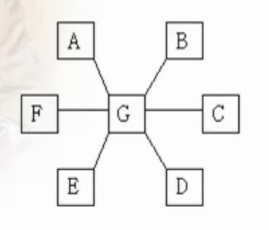
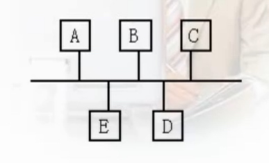
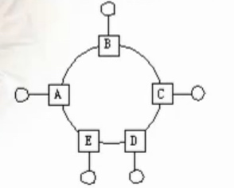
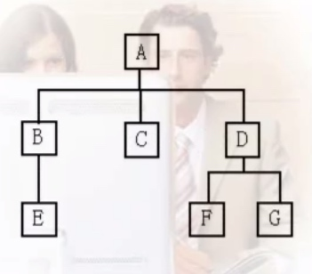
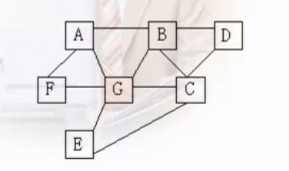

# 拓扑结构
>“拓扑”一词来源于几何学，拓扑学就是首先把实体抽象成与其大小、形状无关的点，连接实体的线路抽象成线，进而研究点、线、面之间的关系。

### 拓扑考虑的问题

	1. 可靠性：可靠传输、易维护、故障检测隔离容易
	2. 费用：信道、安装、维护
	3. 灵活性：扩展、改动
	4. 响应时间和吞吐量

###1、星形拓扑

星形拓扑是由中央结点和通过点到点通信链路接到中央结点的各个站点组成。中央节点负责整个网络的通信控制，可以与网络中任何节点进行通信，非中央节点的两个结点不能直接通信。

优点：
 	1、控制简单。
 	2、故障诊断、隔离容易
 	3、服务方便
缺点：
	1、电缆长度和安装工作量可观
	2、中央节点负担较重，风险集中
	3、各站点分布处理能力低。

###2、总线拓扑

所有站点都通过相应的硬件接口直接连接到这一公共传输媒体上，他是一个能被总线上所有节点所使用的公共信道。需要媒体访问控制。
	

优点：
	1、电缆少。
	2、无缘工作，可靠性高。
	3、易于扩展。
缺点：
	1、距离有限
	2、故障诊断、隔离困难。
	3、媒体访问控制。

###3、环形拓扑

每一个结点都有输入端口和输出端口，结点间通过线路首尾相接，组成一个闭合的环路。每个站点能够接收从一条链路传来的数据，并以同样的速率串行地把该数据沿环送到另一端链路上，数据一般以一个方向传输。也需要媒体访问控制。

优点：
	1、电缆长度短。
	2、增减连接简单。
	3、可用光纤。
缺点：
	1、结点故障影响全网。
	2、故障检测困难。
	3、信道利用率低。（令牌）	

###4、树形拓扑

整个网络形状如同一棵倒置的树，顶端相当于树根，树根以下带分支，每个分支还可再带子分支。每一结点只能和他的根结点或子结点直接通信，同一层次的结点间不能直接通信，各个层次上的根结定（或父结点）负责与其子结点间的通信控制。可见树形拓扑是星形拓扑的的扩展，它也具有星形拓扑的优点和不足。树形拓扑特别适合于象统计具有信息汇聚要求的场合。



###5、网形拓扑

又称无规则网，每个结点都通过多条线路与网中的其它结点连接。这种结构具有很高的可靠性，缺点是结构复杂，成本较高，结点必须具有路由选择算法和流量控制。

###6、混可形拓扑

在具体的网络拓扑结构设计中，往往要根据具体情况综合选择，组合应用，于是就出现了灵活多样的混合型拓扑结构。

