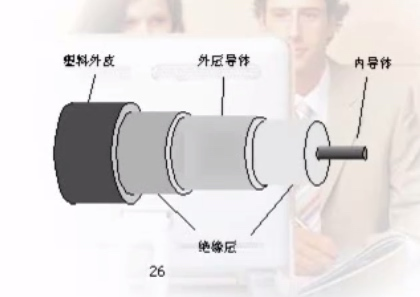

# 传输媒体

>传输媒体大致可分为有线媒体和无线媒体，常用的有线介质有双绞线、同轴电缆、光纤等；无线指在空间传播的电磁波，常用的方法有：地面微波、卫星微波、红外通信、蜂窝通信等。

介质的特性主要有：
1、物理特性：物理结构
2、传输特性：信号，调制技术、容量、频率范围
3、连通特性：点  对 点，多点连接
4、地理范围：最大传输距离
5、抗干扰性：抗电磁干扰能力
6、价格：器件，安装与维护

###1、双绞线

分为非屏蔽双绞线和屏蔽双绞线两种。双绞线有两种相互绝缘的铜导线按一定的规则螺旋绞合在一起构成，这种结构可以减弱电磁干扰。

1、物理特性：铜质

2、传输特性：

模拟信号 － 5到6Km 需要一个放大器
数字信号 － 2到3Km 需要一个中继

1类线，在电话系统中使用，只适合传输语音和低速数据，带宽为268KHz，如果复用24路语音，总传输率可达230kbps；

3类线，是目前电话系统的标准电缆，传输频率为16MHz，数据传输率达10Mbps，主要用于10Base－T；

5类线，传输频率为100MHz，数据传输率达100Mbps，主要用于10Base－T和100Base－T；

3、连通特性：

点 对 点，多点连接

4、地理范围

加中继15公里，10Mbps局域网100米

5、看干扰性：
低频时同轴电缆，10-100KHz时低于同轴电缆

6、价格便宜

###2、同轴电缆
分为两种，一种为系带同轴电缆，宽带同轴电缆；一种为同轴电缆由内导体铜质芯线、内绝缘层、屏蔽层、外绝缘层、塑料保护层五部分构成。

50Ω同轴电缆又称为基带同轴电缆，分为粗缆和细缆。

75Ω同轴电缆是宽带同轴电缆。

1、物理特性
1.02 － 2.54cm

2、传输特征：基带同轴电缆，适用于直接传输基带数字信号，在1公里的距离以内，其传输速率上限可达50Mbps；宽带同轴电缆在100公里的传输内，可用频率高达300MHz － 400MHz，支持150Mbps的数据传输速率。

3、连通特性：点 － 点，多点连接

4、地理范围： 基带几公里；宽带几十公里

5、抗干扰性：优于同轴电缆

6、价格： 居中

###3、光纤

光纤是一种传输光信号的传输媒介，其从中心到外面分别为纤芯、包层、保护层。纤芯是由石英、玻璃或塑料制成的光导纤维。有效光信号能在从纤芯到包层的界面上发生全反射，从而保证光信号低衰减、长距离传输。光纤中单模光纤性能好，多摸光纤性能差。

发光二极管LED － 便宜、多模光纤
注入型激光二极管 － 单模光纤

1、物理特性： 一来一回

0.85um， 多模；
1.3um， 多模或单模；
1.55um  单模

2、传输特性： 主干光纤网络的传输速率已达1600Gbps

3、连通特性： 点 － 点

4、地理范围： 12000公里中美海底光缆中可以实现无转发传输。

5、抗干扰性： 好

6、价格： 贵

###4、无线传输媒体

在一些无法使用有线通信情况下，无线通信就成为必要的通信手段。常用的无线通信的方式有地面微波、卫星微波、红外通信和蜂窝传输等。

地面微波利用微波的直线传输特性，通信受地表曲率的影响，可采用“接力”的方法，微波的频率范围为2GHz － 40GHz。

卫星微波通信是用地球同步通信卫星作为微波通信的中继站。

红外通信一般用于室内和较近距离。（如：蓝牙技术）

蜂窝传输中，将整个服务区划分为一个个蜂窝单元，每个单元都由一个基站控制。

