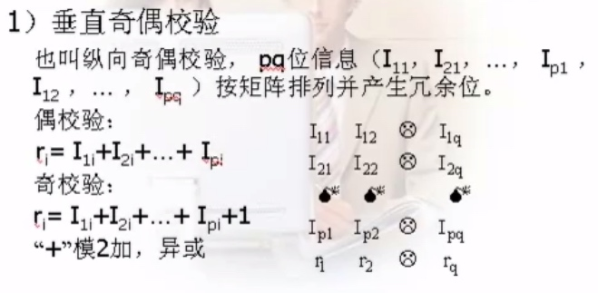
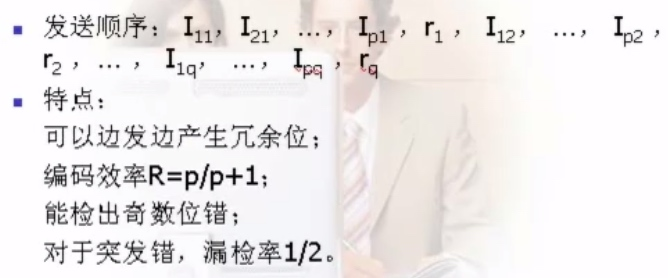

# 差错控制方法

###差错产生的原因及其控制

在通信过程中，有效的检测出错误，并进行矫正，从而提高通信信道传输质量的方法叫差错控制。

####差错原因与类型
传输衰耗、延迟畸变和噪声
传输中的噪声主要包括：热噪声、交调噪声、串音和冲激噪声。

###

热噪声
由传输介质导体和电子器件中的电子热运动产生，比较小，白噪声，它引起的差错一般为随即错。

交调噪声：当不同频率的信号共享同一传输介质时，产生的噪声叫做交调噪声。

串音：一般由相互靠近的双绞线或同轴电缆之间的电器耦合产生。

冲激噪声：具有突发性，并且幅度也比较大，它由不规则的脉冲或幅值较高的尖峰脉冲组成，外界电磁干扰是引起这类噪声的主要原因。

差错控制的目的是使用一些方法发现差错并加以纠正，通常采用在信息码元的基础上增加一些冗余码元，冗余码元与信息码元之间存在一定的关系，传输时，将信息码元与冗余码元组成码组（码字）一起传输。

差错控制的方式基本上有两类：一类是在码组中带有足够的冗余信息，以便在接受后能够发现并自动纠正传输差错，简称为纠错；另一类是在码组中仅包含足以使接收端发现差错的冗余信息，靠重发保证正确传输，简称为检错重发方式，这种方式实现比较简单。

编码效率

	信息位k位，冗余位r位，码字长度 n ＝ k ＋ r，效率 R ＝ k／n
	
	
	
	
	
	
###1、奇偶码校验

增加冗余位，使码字中的“1”的个数为奇数或偶数。

####水平奇偶校验

也叫横向奇偶校验，突发错漏检率低，横向产生校验位。

特点：可以检出长度小于等于p的突发错；

编码效率 R ＝ q/q＋1；
不能边发边产生冗余位，需要存储接收数据。

####水平垂直奇偶校验
也叫纵横奇偶校验。偶校验的冗余位产生

特点：

编码效率  R = pq/[ (p+1) (q+1)]
检错能力：三位及以下错误、所有奇数位错、长度小于等于p+1的突发错，一部分偶数位错。

还能部分纠错。

####循环冗余码
CRC码又称多项式码，是使用广泛的检错码，效率高。

将信息码组中的全部k位数据当作一个从X^k-1 到X^0 的二进制多项式系数序列，例如11000001对应X^7 + X^6 + 1,110110对应X^5 + X^4 + X^2 +X。在发送数据前，发送数据前，发送双方预先约定好的一个多项式，成为生成多项式，生成多项式通常是多种标准多项式的一种。假设所选的生成多项式是一个r阶的多项式，发送方将信息码组中的k位数据后添r个0，相应的码多项式也就变成一个(k+r-1)阶多项式，将这一多项式与生成多项式相除，在这种运算工程中，二进制多项式的乘除运算与普通代数多项式的乘除运算一样，加减运算相当于对应系数的异或运算，相除求得一个(r-1)阶的余数多项式。将余数多项式的系数作为冗余数据加到原来的k位数据后，构成一个(k+r)位的码组，发送方将这一码组数据发出。

接收方接收到数据后，将数据作为多项式系数形成一个(k+r-1)阶的多项式，并用这一多项式于生成多项式相除，如果余数多项式的系数均为0，则说明传输正确；否则，认为传输出错。

CRC码有很强的检错能力，若G(x)的最高幂次数为r，可以检出全部单个错、全部离散二位错、全部奇数个错、全部长度小于等于r位突发错并以[1- (1/2)^r-1 ]的概率检出长度为(r+1)位的突发错，例如r=16,检出17位错的概率可达99.997%.

###海明码
海明码是一种简单实用的一位错纠错编码。

偶校验的监督关系式构造：以偶校验为例
k(=n-1)位数据，一个偶校验位，
S= an-1 + an-2 + ... + a1 + a0 --监督关系式S=0，无错；S=1，有错；S称矫正因子。增加冗余位，可以指出差错

海明码中码组长度n、冗余校验位长度r和码组中的最大数据位长度k满足关系：
n = 2^r -1
k=n-r

在海明码的编码过程中，冗余码从左至右依次填充到2^j(j=0,1,...,r-1)的位置上，码组中剩余位填充数据位，如图所示。

如果冗余码的位数位r，则存在这样一个(2^r -1)行*r列的编码矩阵，矩阵元素等于0或1，并且每一行的元素所组成的二进制编码等于行数的二进制编码。对于海明纠错码，要求码组数据与这一矩阵相乘满足下列关系：

