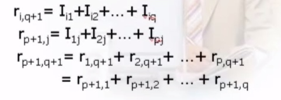

# 差错控制方法

差错产生的原因及其控制

在通信过程中，有效的检测出错误，并进行矫正，从而提高通信信道传输质量的方法叫差错控制。

差错原因与类型
传输衰耗、延迟畸变和噪声
传输中的噪声主要包括：热噪声、交调噪声、串音和冲激噪声。

###

热噪声
由传输介质导体和电子器件中的电子热运动产生，比较小，白噪声，它引起的差错一般为随即错。

交调噪声：当不同频率的信号共享同一传输介质时，产生的噪声叫做交调噪声。

串音：一般由相互靠近的双绞线或同轴电缆之间的电器耦合产生。

冲激噪声：具有突发性，并且幅度也比较大，它由不规则的脉冲或幅值较高的尖峰脉冲组成，外界电磁干扰是引起这类噪声的主要原因。

差错控制的目的是使用一些方法发现差错并加以纠正，通常采用在信息码元的基础上增加一些冗余码元，冗余码元与信息码元之间存在一定的关系，传输时，将信息码元与冗余码元组成码组（码字）一起传输。

差错控制的方式基本上有两类：一类是在码组中带有足够的冗余信息，以便在接受后能够发现并自动纠正传输差错，简称为纠错；另一类是在码组中仅包含足以使接收端发现差错的冗余信息，靠重发保证正确传输，简称为检错重发方式，这种方式实现比较简单。

编码效率

	信息位k位，冗余位r位，码字长度 n ＝ k ＋ r，效率 R ＝ k／n
	
	
	
	
	
	
1、奇偶码校验

增加冗余位，使码字中的“1”的个数为奇数或偶数。

水平奇偶校验

也叫横向奇偶校验，突发错漏检率低，横向产生校验位。

水平奇偶校验

特点：可以检出长度小于等于p的突发错；

编码效率 R ＝ q/q＋1；
不能边发边产生冗余位，需要存储接收数据。

水平垂直奇偶校验
也叫纵横奇偶校验。偶校验的冗余位产生

